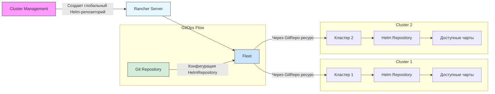

# Процесс управления Helm-репозиториями через Fleet в Rancher:

### Пояснение элементов:
1. **Cluster Management** (розовый):  
   - Интерфейс администратора для создания глобальных Helm-репозиториев

2. **Rancher Server** (голубой):  
   - Центральный управляющий сервер
   - Хранит конфигурацию глобальных репозиториев

3. **Fleet** (синий):  
   - Компонент непрерывной доставки
   - Обрабатывает GitRepo-ресурсы
   - Синхронизирует конфигурацию с кластерами

4. **Git Repository** (зеленый):  
   - Содержит конфигурацию HelmRepository в YAML-формате
   - Изменения в Git автоматически триггерят обновления

5. **Кластеры** (серые блоки):  
   - Получают конфигурацию Helm-репозиториев через Fleet
   - Автоматически индексируют чарты для использования

### Ключевые связи:
- `Cluster Management → Rancher Server`: Администратор создает глобальный источник
- `Rancher Server → Fleet`: Активирует механизм распространения
- `Fleet → Кластеры`: Применяет конфигурацию через GitRepo-ресурсы
- `Git Repository → Fleet`: Обеспечивает GitOps-подход (конфигурация как код)
 